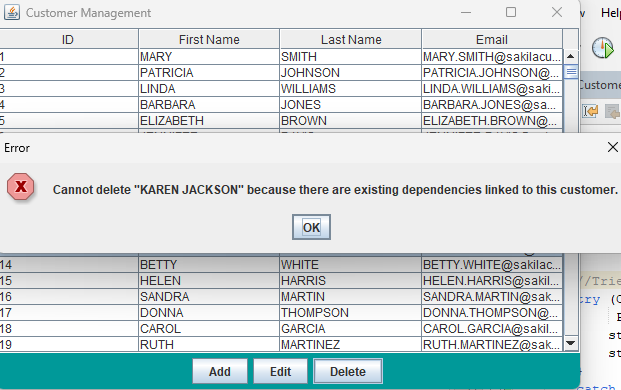

# JakeFinalProject

Welcome to my CustomerManagement System for my Advanced Programming final project.

This project utilizes the sakila sample database in conjunction with MySQL Workbench and Server. Be sure to edit the pom.xl file to your specific version of NetBeans to ensure proper building and connection.
(Uses local root 3306)

Login and DBConnection handle the login and connection to the database.

CustomerMgtMain is the main menu file that handles the core navigation of the program.

    
 <a href = "http://www.catawba.edu">Link to bleh</a> 
